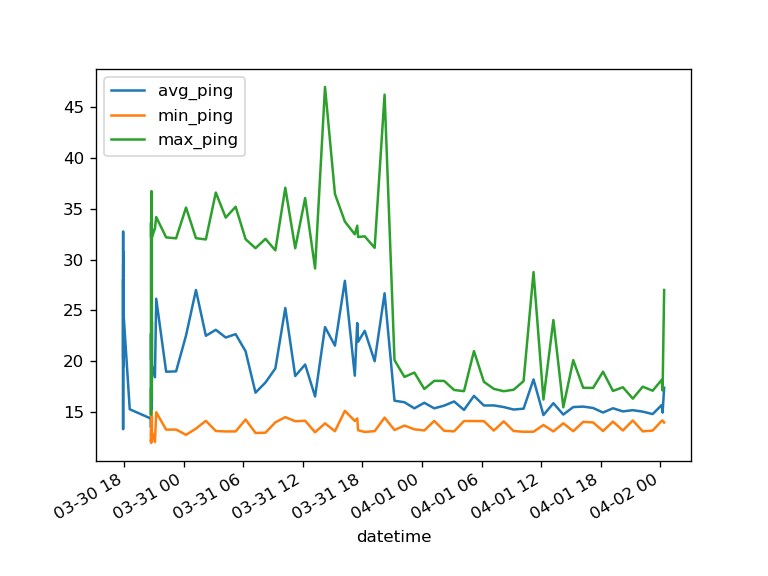
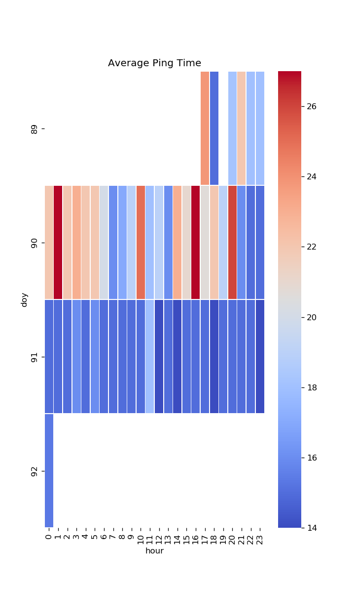

# ping-monitor
## Ping time monitor for Apache Airflow.

This process pings a server on the internet once per hour and records the average, maximum, minimum, 
and mean deviation of ping time in miliseconds in a file called ping.csv.  Plots are then generated 
and saved at *path*.  A simple html dashboard is provided.

I wrote this small utility because I was having issues with my ISP and I needed a way to monitor 
internet connection performance and quickly see that issues had been resolved.  As you can see in 
the sample images, it took a day or so for my ISP to resolve the issue.

This repo requires Airflow to be previously installed.  See https://github.com/apache/airflow

## Setup
1. Copy Ping_time.py into your airflow/dags directory
2. Insert server ping address on line 47.  You can use a DNS server from your ISP.  DO NOT PING 
SERVERS CONSTANTLY OR YOU WILL GET BANNED!
3. Set output file on line 74
4. Set a path where the files will go on line 100.

## Examples
Some example output images are provided:

## TODOs
1. Improve dashboard
2. Harden code

